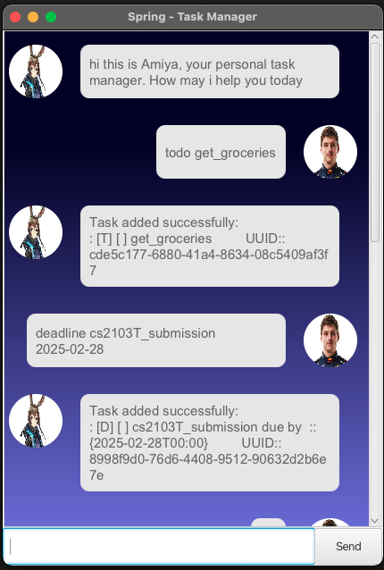

# Spring - A JavaFX Chatbot Todo Tracker


## Overview
Spring is a JavaFX-based chatbot application designed for efficient task and event tracking. It includes advanced features such as:

- **Autosave** to ensure your data is always preserved.
- **Dependency Injection** for modularity and testability.
- **Aspect-Oriented Programming (AOP)** for logging and cross-cutting concerns.

## Getting Started

### Prerequisites
Ensure you have:
- Java 17 or later installed.
- JavaFX dependencies included in your runtime environment.

### Installation
1. Download the latest JAR artifact from the release repository.
2. Run the application using:
   ```sh
   java -jar <path-to-spring.jar>
   ```
3. Once started, you can interact with the chatbot using the following commands.

## Commands Guide

### Searching for Tasks

| Command                                                              | Description                                           |
|----------------------------------------------------------------------|-------------------------------------------------------|
| `find homework`                                                      | Searches for tasks containing the keyword 'homework'. |
| `find date <deadline/event> <to :: YYYY-MM-DD> <from :: YYYY-MM-DD>` | Searches tasks/events within a specified date range.  |
| `find UUID <UUID>`                                                   | Searches a task by its UUID and returns its order.    |

### Adding Tasks
- note that tasks can only be made up of 1 word. for spaces, use underline!

| Command                                                        | Description                                     |
|----------------------------------------------------------------|-------------------------------------------------|
| `todo <name>`                                                  | Adds a new to-do task with the given name.      |
| `deadline <name> <dueby :: YYYY-MM-DD>`                        | Adds a deadline task with a specified due date. |
| `event <name> <startfrom :: YYYY-MM-DD> <endBy :: YYYY-MM-DD>` | Adds an event with start and end dates.         |

### Deleting Tasks

| Command          | Description                                  |
|------------------|----------------------------------------------|
| `clear`          | Deletes all tasks.                           |
| `delete <order>` | Deletes a specific task by its order number. |

### Marking Task Completion

| Command          | Description                |
|------------------|----------------------------|
| `mark <order>`   | Marks a task as completed. |
| `unmark <order>` | Unmarks a completed task.  |

### Marking Task Completion

| Command                          | Description                                         |
|----------------------------------|-----------------------------------------------------|
| `update <order>`                 | launches an interactive update window               |
| `update <order> <args>::<value>` | manually assigns update according to args and value | 

** allowed args : 
1. tasktype : {todo, deadline, event} (non case sensitive)
2. name : single word
3. due : date
4. start : date
5. end : date

- note that whenever a tasktype update is commenced via in-chat command, the name must be provided
  as it was assumed that whenever a tasktype change is made, the name should also be changed
- note that when tasktype is changed to deadline, due needs to be provided
- note that when tasktype is changed to event, start and end both needs to be provided

### Exiting the Application

| Command | Description                                  |
|---------|----------------------------------------------|
| `exit`  | Closes the application.                      |
| `quit`  | Alternative command to exit the application. |
| `bye`   | Another way to close the application.        |

## Features & Design
### 1. **Autosave**
Spring automatically saves tasks after every modification, ensuring data persistence without requiring manual saves.

### 2. **Dependency Injection**
- The application follows DI principles for modular, scalable code.
- Easily testable components with reduced coupling.

### 3. **Aspect-Oriented Programming (AOP)**
- AOP is used for logging and tracking method execution times.
- Reduces boilerplate logging code throughout the application.

## Example Usage
### Adding Tasks
```sh
> todo Buy_groceries
Task Added Successfully: [T][] Buy_groceries UUID:: <UUID>

> deadline Project_submission 2025-02-25
Task Added Successfully: [D][] Project_submission due by: {2025-02-25T<time>} UUID:: <UUID>

> event Seminar 2025-03-01 2025-03-02
Task Added Successfully: [E][] Seminar starting from :: {2025-03-01T<time>}
 ending by:: {2025-03-02} UUID:<UUID>
```

### Searching
```sh
> find homework
Task containing homework: [D][] Submit homework (by: 2025-02-20)

> find date deadline <date 1> <date 2>
Tasks from <date 1> <date 2>
[D][] Submit homework (by: 2025-02-20)
[D][] Submit assignment (by: 2025-02-21)

> find uuid <UUID>
Task found at position <position>
```

### Updating
```sh
> update 2
Interactive rebase starts

> update <order> <arg1>::<value1> <arg2>::<value2> ....
updated to :: <result>

```

### Marking Completion
```sh
> mark 1
Marked as done: [T][X] Buy_goceries
```

### Exiting
```sh
> exit
Bye Bye have a nice day
```

## saves
- automatically done every 30 seconds
- log replay based save
- scheduler used to autosave
- save on exit

## recovery in case of corruption
- the app internally has a backup system in place.
- if both the backup file and original file is corrupted, this will cause a total reset.
- if the backup file survives, the backup file will be used

## Conclusion
Spring provides a seamless task management experience with powerful automation and modern Java principles. Enjoy tracking your tasks efficiently!

